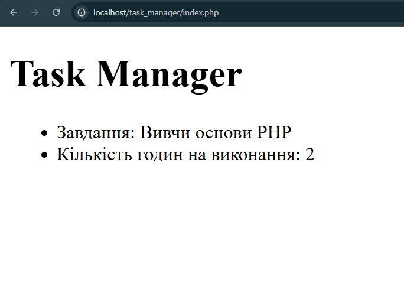

## Код програми (`index.php`)

```php
<?php

    $appName = "Task Manager";
    $taskTitle = "Вивчи основи PHP";
    $taskTimeEstimate = 2;

?>
```

```HTML
<header>

        <h1><?= $appName ?></h1>

        <ul>
            <li>Завдання: <?= $taskTitle ?></li>
            <li>Кількість годин на виконання: <?= $taskTimeEstimate ?></li>
        </ul>

</header>
```
## Результат виконання



## Відповіді на контрольні запитання

1. **Динамічна типізація дозволяє не вказувати тип данних котрі вводятоься у змінні, в PHP змінна розуміє який тип данних був покладений в неї, а також тип данних може змінюватися протягом роботи скрипта**
2. **Блок з PHP-кодом всередині HTML-документа треба відкривати і закривати так - <?= $змінна ?>**
3. **<?php echo $var; ?> - стандартний довгий запис коли <?= $var ?> - стислий спосіб запису**
4. **PHP підтримуцє такі скалярні типи данних: цілі числа(1,2,3,-1,-2,-3), Числа з рухомою комою(1.1,99.99,100.99), Рядки('Hello world'), Логічний(True, False)**
5. **Невиведе нічого, тому що для того щоб браузер зрозумів що написано в коді треба запустити локальний сервер та перейменувати файл с .html на .php**
