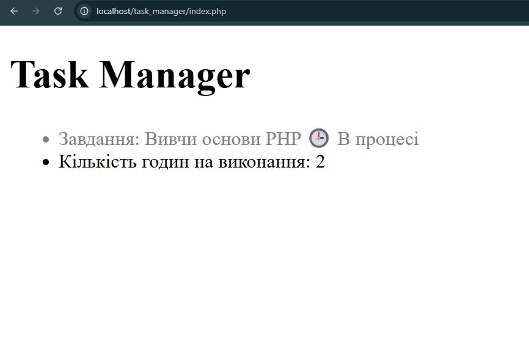

## Код програми (`index.php`)

``` HTML
<head>
    <meta charset="UTF-8">
    
    <style>
        .task-done {
            color: green;
        }

        .task-pending {
            color: gray;
        }
    </style>

</head>

<ul>
    <li class="<?= $IsComplete ? 'task-done' : 'task-pending' ?>">
        Завдання: <?= $taskTitle ?>
        <?php if ($IsComplete == true): ?>
            ✔️ Виконано
        <?php else: ?>
            🕒 В процесі
        <?php endif; ?>
    </li>
```

## Результат виконання



## Відповіді на контрольні запитання

1. **У мові PHP існують такі оператори порівняння як: умовні оператори(if, else, elseif), оператор switch та match, цикли while і do-while та цикл for **
2. **Тотожне порівняння не змінює тип данних при порівнянні на той час коли звичанйне змінює**
## Приклад
''' Звичанй порівняння
if (5 == "5") {
  echo "Числа однакові"
} else {
  echo "Числа не однакові!!"
}
```
**Виведе "Числа однакі"**

''' Звичанй порівняння
if (5 === "5") {
  echo "Числа однакові"
} else {
  echo "Числа не однакові!!"
}
```
**Виведе "Числа не однакі!!"**


3. **Альтернативний синтаксиси потрібен для того, щоб програміст негубив фігурні дужки у коді скрізь великої кількості тегів <div>**
4. **Тетрарний оператор - це короткий запис умовного оператора, який має ткий синтаксис: (Умова) ? [Якщо ТАК] : [Якщо НІ].Його недоцільно використовувати коли вам треба призначити більше ніж один з двох варінтів змінних**
5. **До значення false при перетворенні типів в умові if призводять: false, 0, null, ' ', **
