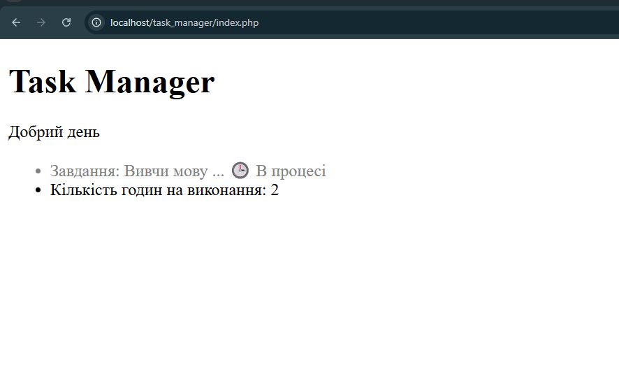

## Код програми (`index.php`)

```
function formatTitle($text, $maxLength = 20) {
        if (strlen($text) > $maxLength) {
            return substr($text, 0, $maxLength) . '...';
        } else {
            return $text;
        }
    }

    function getCurrentGreeting() {
        if (date('H') >= 6 && date('H') < 12) {
            return "Доброго ранку";
        } elseif (date('H') >= 12 && date('H') < 18) {
            return "Добрий день";
        } elseif (date('H') >= 18 && date('H') < 24) {
            return "Добрий вечір";
        } else {
            return "Доброї ночі";
        }
    }
```

## Результат виконання



## Відповіді на контрольні запитання

1.**Принцип DRY це принцип слідуючи яким програмісти замість того щоб ще раз писать одні й тіж розрахунки використвують функції щоб просто викликати цю дію одним рядком, замість того щоб писати все заново**

2.**Аргументи це те, що дозволяє функції бути універсальним для різних вхідних даних. Параметри за замовчуванням це аргумент який не є обов'язковим і він підставляє значення автоматично**
```Приклад функції
function Abc($name, $age = '18')
```
**$name - аргумент, $age - параметр за замовчуванням**

3.**Якщо у функції не написати return та спробувати присвоїти її значення змінній то незважаючи на те якеб значення у функції не було завжди буде виводитись null**

4.**Область видимості - це змінні створені в скрипті і вони бувають різними, а саме Глобальними(змінні котрі можна викликати скрізь у коді) та локальні(змінні котрі можна викликати лише у функціях в яких вони були створені). $taskTitle, створеної за межвми функції без ключового слова global неможливо буде викликати у функції.**

5.**substr використовується для того щоб отримати частину рядка.Приймає такі умови як: рядок с текстом, індекс з якого треба почати, задана довжина**
