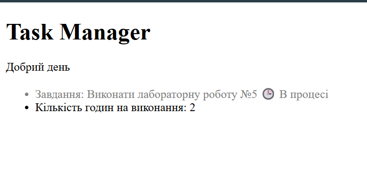

## Код програми (`index.php`)

``` $tasks
 $tasks = [
        [
            'id' => 1,
            'title' => 'Виконати лабораторну роботу №5',
            'priority' => 'High',
            'is_complite' => false,
            'task_estimate' => 2
        ],
        [
            'id' => 2,
            'title' => 'Підготувати звіт з практики',
            'priority' => 'Medium',
            'is_complite' => true,
            'task_estimate' => 4
        ],
        [
            'id' => 3,
            'title' => 'Виконати сиксевен сиксевен разів',
            'priority' => 'Low',
            'is_complite' => false,
            'task_estimate' => 1
        ]
    ];
```
``` foreach
<?php foreach ($tasks as $task): ?>
                <li class=" <?=$task['is_complite'] ? 'task-done': 'task-pending' ?>">
                    Завдання: <?= formatTitle($task['title'],100) ?>
                    <?php if ($task['is_complite']): ?>
                        ✔️ Виконано
                    <?php else: ?>
                        🕒 В процесі
                    <?php endif; ?>
                </li>

                <li>Кількість годин на виконання: <?= $task['task_estimate'] ?></li>
            <?php endforeach; ?>
```
## Результат виконання



## Відповіді на контрольні запитання

1. Індексовані та Асоціативні масиви:
   * **Індексовані:** використовують числові індекси (починаючи з 0).
   * **Асоціативні:** використовують текстові ключі для звернення до значень.

   ```php
   // Індексований масив
   $colors = ['червоний', 'зелений', 'синій'];
   echo $colors[0]; // червоний

   // Асоціативний масив
   $user = ['name' => 'Іван', 'age' => 25];
   echo $user['name']; // Іван
   ```

2. Ключові компоненти які містить цікл foreach це оригінальний масив , змінна для поточного значення та опціонально ключв. Його використовувати краще ніж цикл for тому, що він працює з будь-якими масивами не вимагає знати довжину масиву та не потребує явного створення лічильника.

3. При зверненні до неіснуючого ключа PHP згенерує Warning / Notice (Undefined array key), а вираз поверне null
4. Альтернативний синтаксис використовується для покращення читабельності.
5. 3 корисні вбудовані функції для роботи з масивами:
     1. count($array) — повертає загальну кількість елементів у масиві.
     2. in_array($value, $array) — перевіряє, чи існує значення всередині масиву (true/false).
     3. sort($array) — сортує елементи масиву за зростанням.
