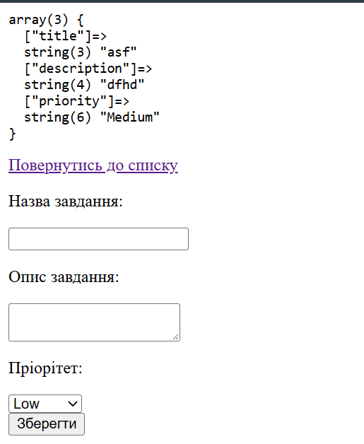

## Код програми (`index.php`)

```Фрагмено <form>
 <form action="create.php" method="POST">
        <p> Назва завдання: </p>
        <input name="title">

        <p>Опис завдання:</p>
        <textarea name="description"></textarea>

        <p>Пріорітет:</p>
        <select name="priority">
            <option>Low</option>
            <option>Medium</option>
            <option>High</option>
        </select><br>

        <button type="submit">Зберегти</button>
    </form>
```

## Результат виконання



## Відповіді на контрольні запитання

1. 3 відмінності між методами POST та GET:
   POST:
     Призначення: Для збереження нових сутностей у базі даних, зміни існуючих або виконання дій, які змінюють стан сервера
     Передача даних: Дані “заховані” в тіло запиту (Request Body). Ви не бачите їх в адресному рядку браузера.
     Обмеження об’єму: Можна відправляти навіть кілька гігабайт інфи або файли (картинки, документи).
   GET:
     Призначення: Тільки для читання, не повинен змінювати дані на сервері (напр., не повинен видаляти файл чи створювати товар).
     Передача даних: Всі передані користувачем параметри прикріплюються відкрито і прозоро прямо в кінець URL-адреси браузера після знаку питання ?
     Обмеження: В URL не можна вставити картину або багато тексту (максимум кілька кілобайт).

2. Метод GET прийнято використовувати для пошукових запитів, фільтрів та навігації. Паролі неможна передовати тому, що Дані з URL потрапляють у відкритому вигляді в історію браузера та можуть бути легко перехоплені або підгледені.

3. Атрибут action вказує URL-адресу куди браузер повинен відправити зібрані дані форми після натискання кнопки відправки.
4. Критерій асоціації даних у PHP вирішальним є атрибут name. Значення цього атрибута стає ключем у суперглобальному масиві $_POST (або $_GET).
5. Функція var_dump() дозволяє розробникам побачити тип та значення кожної змінної чи елементу масиву.А тег <pre> форматує цей вивід у читабельний вигляд із збереженням усіх відступів і переносів рядків.
