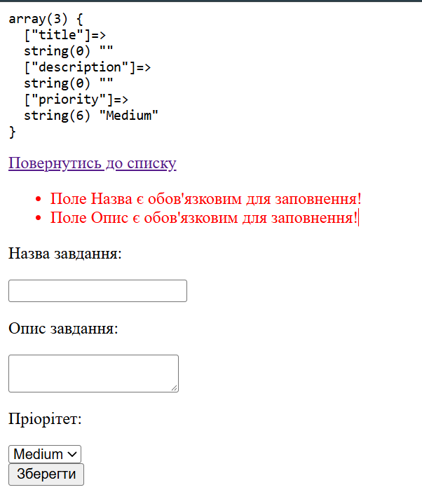

## Код програми (`index.php`)

```Фрагмент коду if ($_SERVER['REQUEST_METHOD'] === 'POST'
 $tasks = [
 if ($_SERVER['REQUEST_METHOD'] === 'POST') {
    $title = htmlspecialchars(trim($_POST['title']));
    $description = htmlspecialchars(trim($_POST['description']));
    $priority = htmlspecialchars(trim($_POST['priority']));

    if (empty($title)){
        $errors[] = "Поле Назва є обов'язковим для заповнення!";
    }

    if (empty($description)){
        $errors[] = "Поле Опис є обов'язковим для заповнення!";
    }
    
    echo "<pre>";
    var_dump($_POST);
    echo "</pre>";
}
```

## Результат виконання



## Відповіді на контрольні запитання

1. Валідація на Фронтенді проти Бекенду:
   Фронтенд миттєво підказує користувачеві про помилки без перезавантаження сторінки.
   Бекенд перевіряє дані безпосередньо на сервері перед збереженням у базу.

2. Серверна валідація критична, оскільки будь-який код на фронтенді можна обійти або відключити.Обхід робиться за секунди: через Інструменти розробника в браузері (F12)
3. Функція trim() видаляє випадкові пробіли, табуляції та переноси рядків з початку й кінця рядка.Вирішує проблеми коли користувач випадково копіює логін чи пароль із пробілом наприкінці, або намагається обійти перевірку на порожнє поле, ввівши лише пробіли

4. htmlspecialchars() Захищає від XSS-атак (Cross-Site Scripting) та випадкової поломки HTML-верстки. Приклад «поганого» тексту: якщо користувач уведе в поле опису:
   ```
   </div><h1 style="color:red">Hacked</h1>
   ```
   без htmlspecialchars() цей код виконається в браузері або зламає структуру сторінки.
   
5.Масив помилок (Error Bag) збирає всі виявлені помилки в один масив. Це забезпечує зручний користувацький досвід: людина одразу бачить повний список того, що треба виправити замість того, щоб після кожного виправлення бачити порожній білий екран із помилкою через die()
